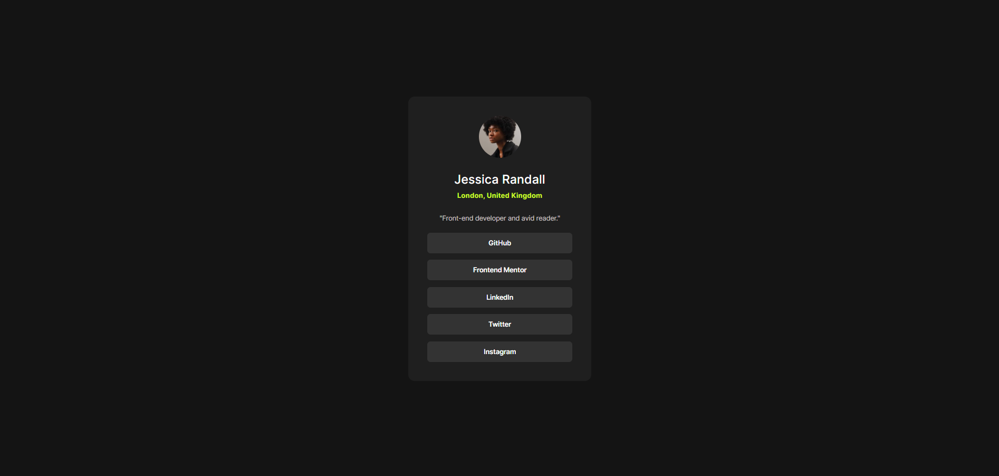

# Frontend Mentor - Social links profile solution

This is a solution to the [Social links profile challenge on Frontend Mentor](https://www.frontendmentor.io/challenges/social-links-profile-UG32l9m6dQ). Frontend Mentor challenges help you improve your coding skills by building realistic projects.

## Table of contents

- [Overview](#overview)
  - [The challenge](#the-challenge)
  - [Screenshot](#screenshot)
  - [Links](#links)
- [My process](#my-process)
  - [Built with](#built-with)
  - [What I learned](#what-i-learned)
  - [Continued development](#continued-development)
  - [Useful resources](#useful-resources)
- [Author](#author)
- [Acknowledgments](#acknowledgments)

## Overview

### The challenge

This project is a solution to the Social Links Profile challenge on Frontend Mentor. The goal of this challenge is to create a simple, responsive social profile card that displays a user's avatar, name, location, a brief description, and buttons linking to various social media profiles. The design should be visually appealing and include hover and focus states for all interactive elements.

The HTML structure consists of a main container that centers the profile card on the page. Inside the card, there is a section for the profile content, which includes an image, name, location, a short bio, and buttons for social media links. The CSS handles the styling, ensuring the profile card is well-formatted and responsive.

Key Features:

- Responsive Design: The profile card is designed to be responsive, adapting to different screen sizes and devices.
- Clean and Modern Aesthetic: The design uses a modern color scheme and typography to create a clean and professional look.

Technical Details:

- HTML5: Used for semantic markup and structuring the content.
- CSS3: Utilized for styling the components, with a focus on Flexbox for layout and responsive design principles.
- Google Fonts: The "Inter" font family is imported to provide a modern and readable typeface.
- File Structure:
  HTML File: Contains the structure of the profile card.
  CSS File: Includes all the styles applied to the profile card and its elements.
  Assets: Images used in the project, including the user's avatar and the favicon.

### Screenshot



### Links

- Solution URL: [Solution](https://your-solution-url.com)
- Live Site URL: [Live](https://your-live-site-url.com)

## My process

### Built with

- Semantic HTML5 markup
- CSS custom properties
- Flexbox
- Mobile-first workflow

### What I learned

During this project, I learned how to effectively use Flexbox for layout and how to style buttons and interactive elements with CSS to achieve a consistent and aesthetically pleasing look. Here are some snippets of code that I'm particularly proud of:

```html
<button type="button">GitHub</button>
```

```css
button {
  background-color: hsl(0, 0%, 20%);
  color: #fff;
  padding: 0.6rem 1rem;
  font-weight: 600;
  border: none;
  border-radius: 5px;
  font-family: "Inter", sans-serif;
  font-size: 10px;
}
```

### Continued development

In future projects, I want to focus on:

- Improving my understanding of CSS Grid and how it can complement Flexbox in layout design.
- Enhancing the responsiveness of web pages to provide a better user experience across different devices.

### Useful resources

- [The Markdown Guide ](https://www.markdownguide.org/) - This guide helped me improve my Markdown skills for writing documentation.
- [CSS Tricks - A Complete Guide to Flexbox](https://css-tricks.com/snippets/css/a-guide-to-flexbox/) - This article helped me understand the Flexbox layout and how to use it effectively.

## Author

- Frontend Mentor - [@Dev-Farhan](https://www.frontendmentor.io/profile/Dev-Farhan)
- Linkedin - [Mohammad Farhan](https://www.linkedin.com/in/mohd-farhan0678/)

## Acknowledgments

Thanks to Frontend Mentor for providing these challenges which help in enhancing my front-end development skills.
